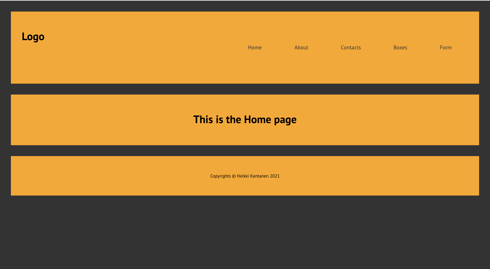
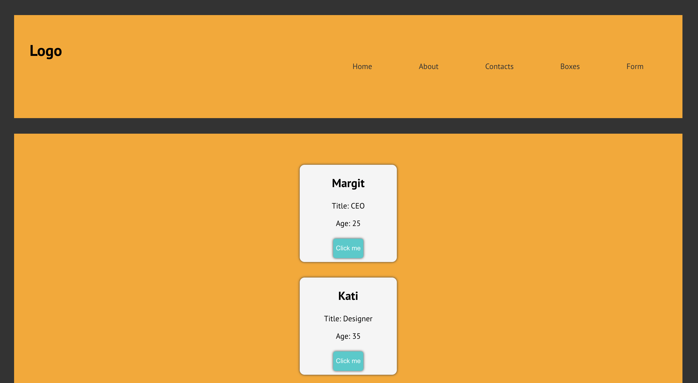
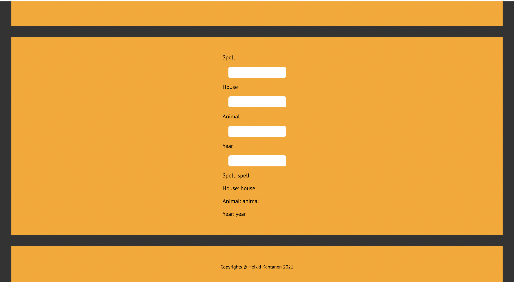

# Boxes Demo

## Description: 

Simple excercise developed with React.js for the Full Stack Web Development program in Business College Helsinki.

An React application that has header navigation, shows data in Boxes and has a form.

### Application screenshots: 

